```mermaid
graph TB
    %% RxOpsComponent Architecture
    subgraph "🏗️ RxOpsArchitecture System"
        
        %% Design System Foundation
        subgraph "🎨 Design System Foundation"
            DS[Design System]
            DS --> DT[Design Tokens]
            DS --> DC[Design Components]
            DS --> DU[Design Utils]
            
            DT --> ST[Semantic Tokens]
            DT --> CT[Component Tokens] 
            DT --> HT[Healthcare Tokens]
            
            ST --> SIZE[Size System]
            ST --> COLOR[Color Palette]
            ST --> SPACE[Spacing Scale]
            ST --> TYPE[Typography]
            
            CT --> INTENT[Color System]
            CT --> VARIANT[Variant System]
            CT --> STATE[State System]
            
            HT --> MEDICAL[Medical Priority]
            HT --> RECORD[Record Status]
            HT --> MEDICATION[Medication Types]
        end
        
        %% Core Component System (Atomic Design)
        subgraph "⚛️ Atomic Component System"
            
            %% Atoms Layer
            subgraph "🔬 Atoms (24 Components)"
                ATOMS[Core Atoms]
                ATOMS --> BTN[Button]
                ATOMS --> INPUT[Input]
                ATOMS --> TEXT[Text]
                ATOMS --> ICON[Icon]
                ATOMS --> BADGE[Badge]
                ATOMS --> ALERT[Alert]
                ATOMS --> AVATAR[Avatar]
                ATOMS --> SPINNER[Spinner]
                
                BTN --> BTN_VAR[Primary, Secondary, Outline, Ghost]
                INPUT --> INPUT_TYPE[Text, Email, Password, Number]
                TEXT --> TEXT_SEM[H1-H6, Body, Caption, Label]
            end
            
            %% Molecules Layer
            subgraph "🧪 Molecules (15 Components)"
                MOLECULES[Core Molecules]
                MOLECULES --> FORMFIELD[FormField]
                MOLECULES --> SEARCH[SearchAndFilter]
                MOLECULES --> DATETIME[DateTimePicker]
                MOLECULES --> UPLOAD[FileUpload]
                MOLECULES --> SELECT[Select]
                MOLECULES --> TABS[Tabs]
                MOLECULES --> BREADCRUMB[Breadcrumb]
                
                FORMFIELD --> VALIDATION[Built-in Validation]
                SEARCH --> FILTERS[Healthcare Filters]
                DATETIME --> APPOINTMENT[Appointment Picker]
            end
            
            %% Organisms Layer
            subgraph "🦠 Organisms (20 Components)"
                ORGANISMS[Core Organisms]
                ORGANISMS --> HEADER[Header]
                ORGANISMS --> CARD[Card System]
                ORGANISMS --> DATAGRID[DataGrid]
                ORGANISMS --> MODAL[Modal]
                ORGANISMS --> FORM[Form]
                ORGANISMS --> TABLE[Table]
                ORGANISMS --> CONTAINER[Container]
                ORGANISMS --> GRID[Grid System]
                
                CARD --> CARD_VAR[Patient, Doctor, Appointment]
                DATAGRID --> DATA_FEAT[Sorting, Filtering, Pagination]
                FORM --> FORM_VAL[Real-time Validation]
            end
        end
        
        %% Healthcare Domain Components
        subgraph "🏥 Healthcare Domain System"
            
            %% Patient Domain
            subgraph "👤 Patient Domain (8 Components)"
                PATIENT[Patient Domain]
                PATIENT --> PROFILE[PatientProfile]
                PATIENT --> VITALS[VitalSigns] 
                PATIENT --> HISTORY[MedicalHistory]
                PATIENT --> DASHBOARD_P[HealthDashboard]
                
                PROFILE --> P_COMP[Card + Stack + Text + Badge]
                VITALS --> V_COMP[Grid + HealthMetric + Chart]
                HISTORY --> H_COMP[List + Timeline + Card]
            end
            
            %% Provider Domain  
            subgraph "👨‍⚕️ Provider Domain (6 Components)"
                PROVIDER[Provider Domain]
                PROVIDER --> DOCTOR[DoctorCard]
                PROVIDER --> CONSULT[ConsultationNotes]
                PROVIDER --> PRESCRIPTION[PrescriptionMgmt]
                PROVIDER --> DASHBOARD_PR[ProviderDashboard]
                
                DOCTOR --> D_COMP[Card + Avatar + Rating + Actions]
                CONSULT --> C_COMP[Form + RichText + Templates]
            end
            
            %% Appointments Domain
            subgraph "📅 Appointments Domain (5 Components)"
                APPOINTMENTS[Appointments Domain]
                APPOINTMENTS --> CALENDAR[AppointmentCalendar]
                APPOINTMENTS --> APPT_CARD[AppointmentCard]
                APPOINTMENTS --> VIDEO[VideoCall]
                
                CALENDAR --> CAL_COMP[Calendar + TimeSlots + Booking]
                APPT_CARD --> AC_COMP[Card + Status + Actions + Patient]
            end
            
            %% Medical Domain
            subgraph "🩺 Medical Domain (8 Components)"
                MEDICAL[Medical Domain]
                MEDICAL --> MEDICATION[MedicationTracker]
                MEDICAL --> IMAGING[ImagingViewer]
                MEDICAL --> RECORDS[MedicalRecordCard]
                MEDICAL --> LAB[LabResults]
                MEDICAL --> EMERGENCY[EmergencyAlert]
                
                MEDICATION --> MED_COMP[List + Schedule + Alerts + Interactions]
                LAB --> LAB_COMP[Table + Charts + Trends + Flags]
            end
        end
        
        %% Layout System
        subgraph "📐 Layout System (Advanced)"
            LAYOUT[Layout System]
            LAYOUT --> LAYOUTS[Page Layouts]
            LAYOUT --> PRIMITIVES[Layout Primitives]
            
            LAYOUTS --> EMPTY[EmptyLayout]
            LAYOUTS --> PUBLIC[PublicLayout]
            LAYOUTS --> AUTH[AuthLayout] 
            LAYOUTS --> USER[UserLayout]
            LAYOUTS --> ADMIN[AdminLayout]
            LAYOUTS --> PROV_LAYOUT[ProviderLayout]
            
            PRIMITIVES --> ROW[Row]
            PRIMITIVES --> COLUMN[Column]
            PRIMITIVES --> STACK[Stack]
            PRIMITIVES --> FLEX_STACK[FlexStack]
            
            %% Layout Composition
            USER --> ROW
            USER --> CONTAINER
            ADMIN --> GRID
            ADMIN --> CARD
        end
        
        %% Enhanced Features (Proposed)
        subgraph "🚀 Enhanced Features (Proposed)"
            ENHANCED[Enhanced System]
            ENHANCED --> COMPOUND[Compound Patterns]
            ENHANCED --> SMART[Smart Components]
            ENHANCED --> PERF[Performance Opts]
            ENHANCED --> AI[AI Integration]
            
            COMPOUND --> SLOT[Slot-based Architecture]
            SMART --> STATE[Built-in State Mgmt]
            PERF --> VIRTUAL[Virtualization]
            AI --> INSIGHTS[Clinical Insights]
            
            %% Enhanced Examples
            SLOT --> PATIENT_COMP[PatientCard.Header/Body/Actions]
            STATE --> FORM_STATE[Form Recovery & Validation]
            VIRTUAL --> LARGE_DATA[Large Dataset Handling]
            INSIGHTS --> CLINICAL[Clinical Decision Support]
        end
    end
    
    %% Data Flow & Dependencies
    DS -.->|Tokens| ATOMS
    DS -.->|Tokens| MOLECULES  
    DS -.->|Tokens| ORGANISMS
    
    ATOMS -.->|Compose| MOLECULES
    MOLECULES -.->|Compose| ORGANISMS
    ORGANISMS -.->|Compose| PATIENT
    ORGANISMS -.->|Compose| PROVIDER
    ORGANISMS -.->|Compose| APPOINTMENTS
    ORGANISMS -.->|Compose| MEDICAL
    
    PRIMITIVES -.->|Layout| PATIENT
    PRIMITIVES -.->|Layout| PROVIDER
    PRIMITIVES -.->|Layout| APPOINTMENTS
    PRIMITIVES -.->|Layout| MEDICAL
    
    %% Current Status Indicators
    DS:::tokenized
    ATOMS:::tokenized
    PATIENT:::healthcare
    PROVIDER:::healthcare
    APPOINTMENTS:::healthcare
    MEDICAL:::healthcare
    ENHANCED:::proposed
    
    %% Styling
    classDef tokenized fill:#e1f5fe,stroke:#0277bd,stroke-width:2px
    classDef healthcare fill:#f3e5f5,stroke:#7b1fa2,stroke-width:2px  
    classDef proposed fill:#fff3e0,stroke:#f57c00,stroke-width:2px,stroke-dasharray: 5 5
```

## 🏗️ Architecture Legend

**📊 Current Status:**
- 🔵 **Tokenized** (24/374 components) - Using centralized design tokens
- 🟣 **Healthcare** (50+ components) - Domain-specific healthcare components  
- 🟠 **Proposed** (Enhanced features) - Recommended architectural improvements

**🔄 Component Flow:**
- **Design Tokens** → **Atomic Components** → **Healthcare Domains**
- **Layout Primitives** → **Page Layouts** → **Domain Applications**
- **Enhanced Features** → **All Layers** (Cross-cutting improvements)

**⚛️ Atomic Hierarchy:**
- **Atoms** (24) → **Molecules** (15) → **Organisms** (20) → **Healthcare Domains** (50+)
- **Total Components**: 374 (with 189 planned migration tasks)
